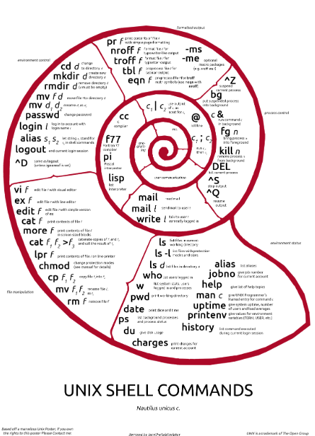

# Custom Simple Shell HSH :shell:

## Table of contents :scroll:
 - **About this project**
 - **Usage**
 - **Compiler**
 - **How does the shell work?**
 - **Basic Shell Features**
 - **List of allowed functions and system calls**
 - **Bugs**
 - **Contributors**

## About this project :bulb:
This project was created for study and learning purposes for Holberton School :tunisia:. To create our custom Command Line Interpreter or (CLI).
It is a **simple UNIX Command Line Interpreter** developed in the [C Programming Language](https://en.wikipedia.org/wiki/C_(programming_language)) and based on the first ever Unix Shell : The [Thompson Shell](https://en.wikipedia.org/wiki/Thompson_shell) introduced in the first version of Unix in 1971, and was written by **Ken Thompson**.
It is not used anymore and was replaced by The [Bourne Shell](https://en.wikipedia.org/wiki/Bourne_shell) in 1979.

## Usage :wrench:
Please clone the repository by copying this :
**https://github.com/MounaBenAli/simple_shell.git**

## Compiler :wrench:
Please compile by copying this :
**gcc -Wall -Werror -Wextra -pedantic -std=gnu89 *.c -o hsh**

## How does the shell work?:mag_right:
Since the early days of Unix, the shell has been part of the user's interface with the operating system. 
The first Unix shell (the Thompson shell) had very limited features, mainly I/O redirection and command pipelines. Later shells expanded on that early shell and added more and more capabilities, which gave us powerful features that include word expansion, history substitution, loops and conditional expressions, among many others.
This model of the **Shell** acts as the user's interactive interface to the operating system.
It is the layer of programmming that understands and executes the commands the user enters.
As the outer layer of the operating system, the **Shell** can be contrasted with the **Kernel** the operating system inner most layer or core.

## Basic Shell Features:toolbox:
0. Prints a prompt in an infinite loop and waits for input string
1. Passes the input string into a temporary buffer
2. Tokenizes the buffered input string into tokens and parses them as the command line arguments
3. Searches for the similar token in the down the PATH 
4. If a match to the command (aka program name) is found, the original or parent program found will be duplicated and child process must be created with system calls like fork(), wait() and exec().
5. Print the Environment 
6. If the exit command is entered by user the shell will Exit 

## List of allowed functions and system calls:hammer_and_wrench:
 - access (man 2 access)
 - chdir (man 2 chdir)
 - close (man 2 close)
 - closedir (man 3 closedir)
 - execve (man 2 execve)
 - exit (man 3 exit)
 - _exit (man 2 _exit)
 - fflush (man 3 fflush)
 - fork (man 2 fork)
 - free (man 3 free)
 - getcwd (man 3 getcwd)
 - getline (man 3 getline)
 - isatty (man 3 isatty)
 - kill (man 2 kill)
 - malloc (man 3 malloc)
 - open (man 2 open)
 - opendir (man 3 opendir)
 - perror (man 3 perror)
 - read (man 2 read)
 - readdir (man 3 readdir)
 - signal (man 2 signal)
 - stat (__xstat) (man 2 stat)
 - lstat (__lxstat) (man 2 lstat)
 - fstat (__fxstat) (man 2 fstat)
 - strtok (man 3 strtok)

## Bugs :wrench:
Unkown

## Collaborators :muscle::brain::sunglasses:
[Mouna Ben Ali](https://github.com/MounaBenAli)
[Mohamed Anwer Hassine](https://github.com/HassineMohamedAnwer)
[Med Aziz Dali](https://github.com/Azizo1212)
